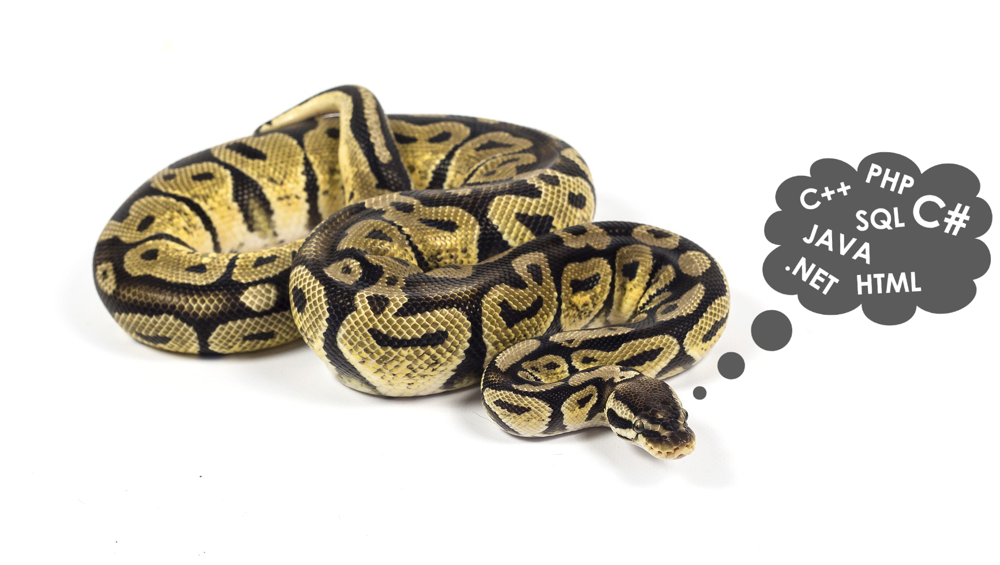
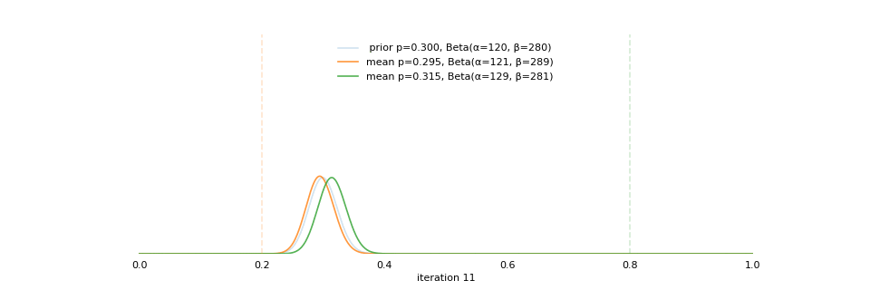

## Data Science Blogs
All blogs are published in *__Toward Data Science__* for which I am an official author. Except for my first blog, all blogs are restricted to paid members only. Non-members can only read up to a certain limit per month.

This page contains friend links to directly access __all__ my Medium blog posts without limit or membership requirement. 

___ 
__Beyond A/B Testing: Multi-armed Bandit Experiments__ ([7 min read](https://towardsdatascience.com/beyond-a-b-testing-multi-armed-bandit-experiments-1493f709f804?source=friends_link&sk=b30f5cfa1ff225099cb512dd6653cf3d))

*Implementing Google Analytics’ stochastic k-armed bandit test with Thompson sampling and Monte Carlo simulation*

___
__Seeding Viral Growth: An Application of Graph Embedding__ ([6 min read](https://towardsdatascience.com/https-towardsdatascience-com-the-elements-of-viral-growth-7f364aec64eb?source=friends_link&sk=eb19423d3e8df3d1cd70a30dade9cff0))

*Simulating different seeding techniques to maximize information diffusion in a network*

    

___
__Feature Engineering in SQL and Python: A Hybrid Approach__ ([5 min read](https://towardsdatascience.com/feature-engineering-in-sql-and-python-a-hybrid-approach-b52347cd2de4?source=friends_link&sk=20472db1eddc9ab2bff51be25b910bea))

*Reduce workspace clutter, maintain a clean namespace, and effortlessly keep your dataset up-to-date*

    

___
__Visualizing Beta Distribution and Bayesian Updating__ ([3 min read](https://towardsdatascience.com/visualizing-beta-distribution-7391c18031f1?source=friends_link&sk=97d1259bbf57fe2aa2cf1e05be4e55ba))

*Seeing is believing: build intuition by simulating everything, visualizing everything, and inspecting everything*

___
__Understanding Confidence Interval__ ([5 min read](https://towardsdatascience.com/understanding-confidence-interval-d7b5aa68e3b?source=friends_link&sk=894ac634898f489262e79e3bf66016fe))

*Think frequentist, not Bayesian: a simulation of one million experiments on Udacity engagement dataset*

___
__The Power of A/B Testing__ ([5 min read](https://towardsdatascience.com/the-power-of-a-b-testing-3387c04a14e3?source=friends_link&sk=eb9621b10f5af99d95584ac1d0fb7a71))

*A visual summary of how sample size, effect size and significance level affect the power of A/B testing*

___
__A Graph DB Case Study: Chinese Idioms__ ([5 min read](https://towardsdatascience.com/the-power-of-a-b-testing-3387c04a14e3?source=friends_link&sk=eb9621b10f5af99d95584ac1d0fb7a71))

*Build a Neo4J Graph Database Application with 20 Lines of Python*

